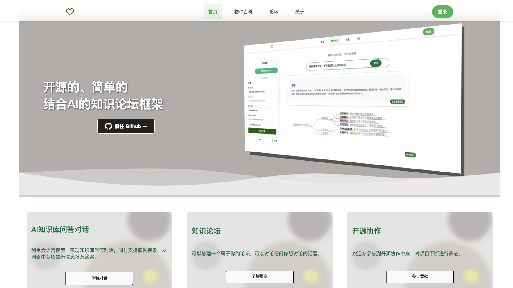
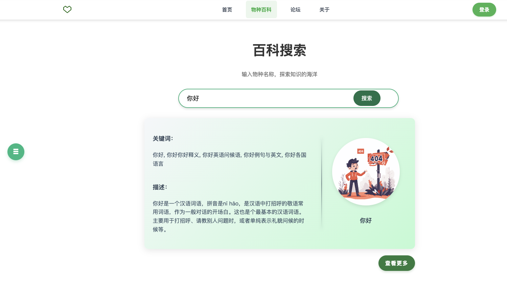
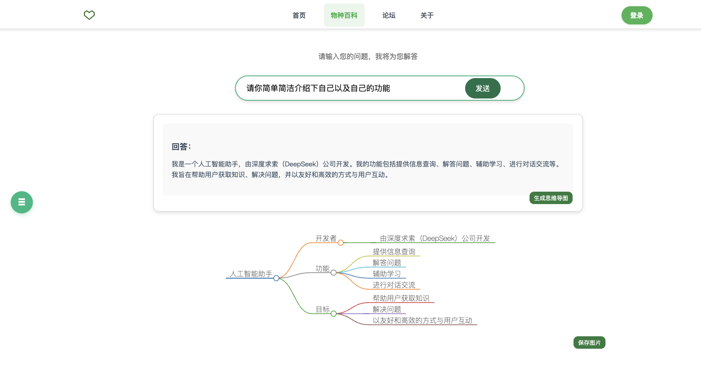
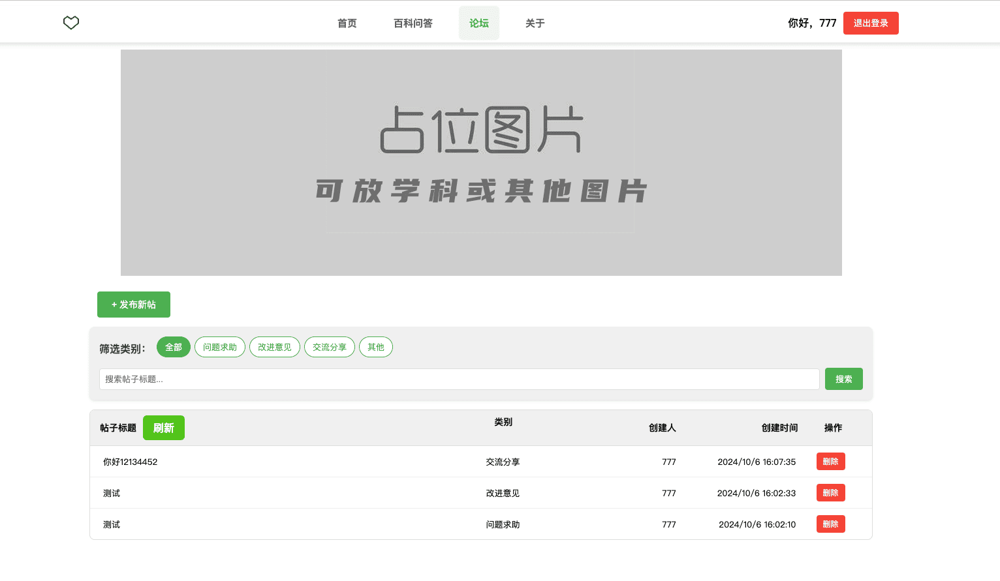
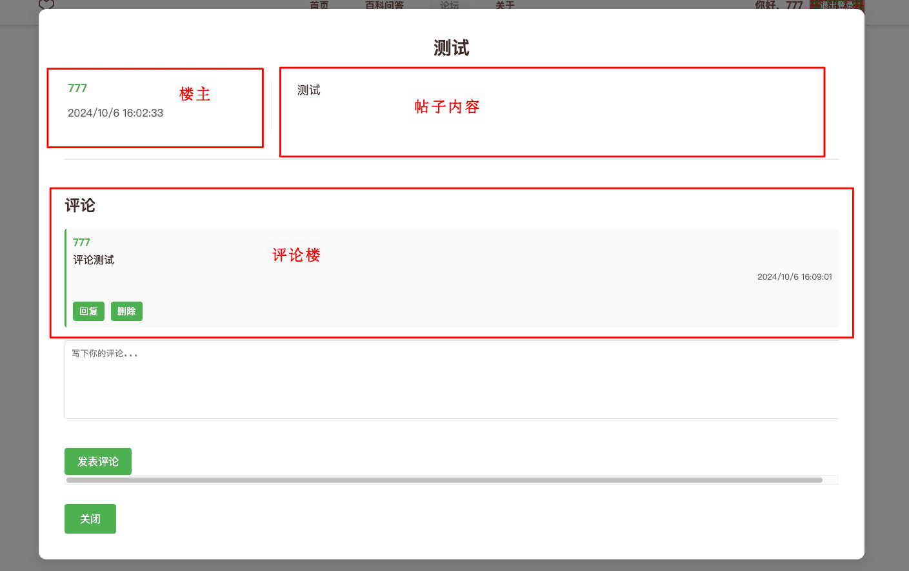

# 基于xx数据库的知识问答服务系统

<!-- PROJECT SHIELDS -->
[![Contributors][contributors-shield]][contributors-url]
[![Forks][forks-shield]][forks-url]
[![Stargazers][stars-shield]][stars-url]
[![MIT License][license-shield]][license-url]
<!-- PROJECT LOGO -->

本人并非专业前端选手，本项目基于 `next.js` 进行开发，若感觉项目结构比较混乱，欢迎提PR。


## 待开发功能
- 论坛


## 开始
**运行项目:**

⚠️ 首次运行项目前，需要先运行初始化数据库的脚本。
- 在命令行或终端中输入以下命令：
```bash
npm install
npm run initialize-db
```

- 然后输入以下命令启动项目：
```bash
npm run dev
```

在浏览器打开链接 [http://localhost:3000](http://localhost:3000) 在浏览器中查看结果。

项目中使用了 Next.js 的字体优化功能，特别是用于加载和优化 Inter 字体，这是一种 Google 提供的自定义字体。链接指向了 Next.js 文档中关于字体优化的详细说明。链接：[next/font](https://nextjs.org/docs/basic-features/font-optimization)

## 目录结构
```bash
# 首次进去的主页面
src/app/page.js
# 初始化用户账号数据库脚本
.init-db.js

# src
|--src
    |----app # 主页面
        |----favicon.ico # 网站图标
        |----layout.js # 主页面布局
        |----page.js # 主页面
        |----page.module.css # 主页面样式
        |----(other) # 其他
    |----components # 组件
        |----baike # 百科
            |----BaikeSearch.js # 百科搜索页面
            |----KnowledgeAnswer.js # 知识问答页面
            |----uploadFiles.js # 上传文件页面
        |----user # 用户相关；页面样式什么的可以在这改
            |----background.css # 登录注册页面的背景
            |----login.module.css # 登录注册页面的样式
            |----register.js # 注册页面
            |----ForgotPW.js # 忘记密码、重置密码页面
            |----Login.js # 登录页面
        |----forum # 论坛(还没将函数搬运过来)
        |----ui # 各类UI组件
    |----styles # 存放各类样式css文件
|--public # 存放公共资源，例如图片等

# pages
|--pages
    |----api # 接口
        |----forgot-password # 忘记密码，重置密码
        |----register # 注册
        |----login # 登录
        |----(other) # 其他
    |----BaikeSearch # 顶部导航栏的物种百科子页面
        |----baikeSearch.js # 百科搜索页面
        |----conversation.js # 对话页面
        |----uploadFiles.js # 上传文件页面
    |----about # 关于页面
    |----BaikeSearch.js # 顶部导航栏的物种百科总页面
    |----forum.js # 论坛页面
    |----helloWorld.js # 主页，懒得改了
    |----forgot-password.js # 忘记密码，重置密码页面
    |----register.js # 注册页面
    |----login.js # 登录页面
    |----helloWorld.js # 测试页面


# 后端
|--Server
    |----config.yml # 配置文件
    |----init_db.py # 初始化论坛数据库脚本
    |----main.py # FastAPI主文件
    |----utils.py # 工具函数文件
    |----ProcessFiles.py # 处理文件到数据库的函数
    |----Retriver.py # 检索文件的函数
    |----uploads # 里面有以用户名命名的文件夹，存放用户上传的文件
```


## 页面预览

背景什么的可以自己换

**首页**


**登录页面**


**百科页面**


**问答对话页面**


**论坛页面**


**论坛帖子页面**

<!-- links -->
[your-project-path]:Chal1ce/A-Single-Framework-For-KnowledgeBaseQA
[contributors-shield]: https://img.shields.io/github/contributors/Chal1ce/A-Single-Framework-For-KnowledgeBaseQA.svg?style=flat-square
[contributors-url]: https://github.com/Chal1ce/A-Single-Framework-For-KnowledgeBaseQA/graphs/contributors
[forks-shield]: https://img.shields.io/github/forks/Chal1ce/A-Single-Framework-For-KnowledgeBaseQA.svg?style=flat-square
[forks-url]: https://github.com/Chal1ce/A-Single-Framework-For-KnowledgeBaseQA/network/members
[stars-shield]: https://img.shields.io/github/stars/Chal1ce/A-Single-Framework-For-KnowledgeBaseQA.svg?style=flat-square
[stars-url]: https://github.com/Chal1ce/A-Single-Framework-For-KnowledgeBaseQA/stargazers
[issues-shield]: https://img.shields.io/github/issues/Chal1ce/A-Single-Framework-For-KnowledgeBaseQA.svg?style=flat-square
[issues-url]: https://img.shields.io/github/issues/Chal1ce/A-Single-Framework-For-KnowledgeBaseQA.svg
[license-shield]: https://img.shields.io/github/license/Chal1ce/A-Single-Framework-For-KnowledgeBaseQA.svg?style=flat-square
[license-url]: https://github.com/Chal1ce/A-Single-Framework-For-KnowledgeBaseQA/blob/master/LICENSE.txt
[linkedin-shield]: https://img.shields.io/badge/-LinkedIn-black.svg?style=flat-square&logo=linkedin&colorB=555
[linkedin-url]: https://linkedin.com/in/shaojintian